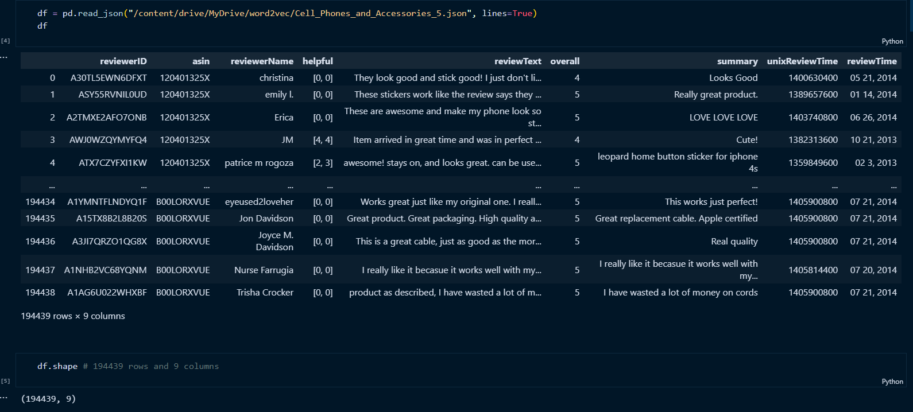

# Word2Vec Fine-Tuning for Cell Phones and Accessories Dataset

This repository contains the code and resources for fine-tuning Word2Vec embeddings on a dataset of cell phones and accessories. The dataset comprises 194,439 rows and 9 columns, covering various aspects related to cell phones and accessories.

## Screenshots

## Purpose
The main objective of this project is to fine-tune pre-trained Word2Vec embeddings on the dataset of cell phones and accessories. By doing so, we aim to create domain-specific word embeddings that capture the semantic nuances and relationships specific to this domain. These fine-tuned embeddings can then be used to enhance various NLP tasks such as sentiment analysis, recommendation systems, and product categorization within the cell phone and accessories domain.

## Contents
- Data Preprocessing: Cleaning and preprocessing of the dataset, including text normalization, tokenization, and handling missing values.
- Word2Vec Fine-Tuning: Fine-tuning pre-trained Word2Vec embeddings on the preprocessed dataset to capture domain-specific semantics.
- Evaluation: Evaluation of the fine-tuned embeddings using qualitative and quantitative metrics, such as similarity analysis and word analogy tasks.

